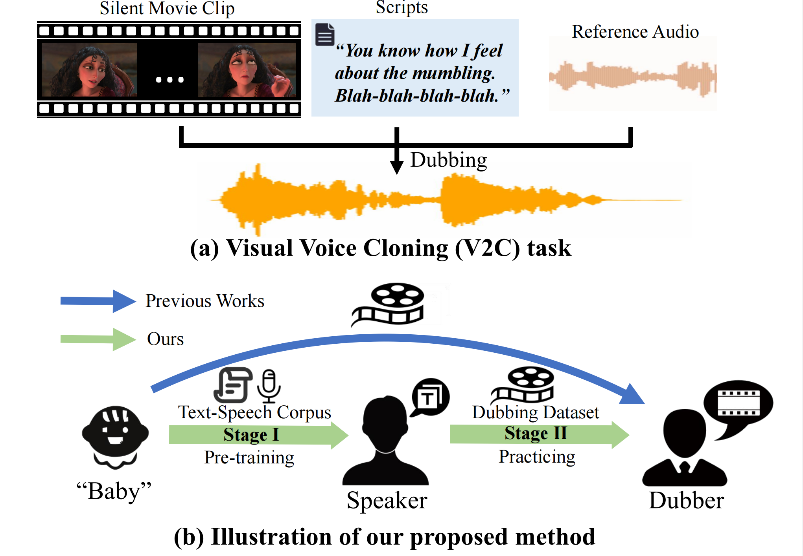

# Speaker2Dubber

[ACM MM24] Official implementation of paper "From Speaker to Dubber: Movie Dubbing with Prosody and Duration Consistency Learning"

## 🗒 TODOs

- [x] Release Speaker2Dubber‘s demo at [here](https://speaker2dubber.github.io/).

- [ ] Release the generated test set.

- [ ] Release Speaker2Dubber's train and inference code.

- [ ] Update README.md (How to use).

## 📊 Dataset

- GRID ([BaiduDrive](https://pan.baidu.com/s/1E4cPbDvw_Zfk3_F8qoM7JA) (code: GRID) / GoogleDrive)
- V2C-Animation dataset (chenqi-Denoise2) 

## 🙏 Acknowledgments
We would like to thank the authors of previous related projects for generously sharing their code and insights: [HPMDubbing](https://github.com/GalaxyCong/HPMDubbing), [Monotonic Align](https://github.com/resemble-ai/monotonic_align), [StyleSpeech](https://github.com/keonlee9420/StyleSpeech), [FastSpeech2](https://github.com/ming024/FastSpeech2), [V2C](https://github.com/chenqi008/V2C), and [HiFi-GAN](https://github.com/jik876/hifi-gan).
